### 第32回生理科学実験技術トレーニングコース

# SPMを用いたヒト脳のfMRIデータ解析入門

2021年8月3-6日に生理学研究所でWeb開催する **『第32回生理科学実験技術トレーニングコース・SPMを用いたヒト脳のfMRIデータ解析入門』** の参加者を対象とした情報提供サイトです。随時、情報を追加していきますので、このサイトへ定期的にアクセスするようにして下さい。

## 新着情報

- 2021.07.31 講義スケジュールの一部を変更しました
- 2021.07.26 トレーニングコース用ウェブサイトを立ち上げました


## スタッフ（運営、講師、チューター）

- 生理学研究所　心理生理学研究部門

- 国際電気通信基礎技術研究所(ATR)	河内山隆紀

- 株式会社アラヤ　近添淳一

- 情報通信研究機構 脳情報通信融合研究センター(CiNet)　林正道

- 筑波大学　根本清貴

- 名古屋大学 田邊宏樹


## 開催案内

- Web開催です

- Zoomの開始時間は、**08：30** です


## 当日のタイムテーブル

日程 | 内容
---- | ----
8月3日 |
08:30 | Zoomオープン
09:00-09:20 | コース概要など説明（小池）
09:20-10:20 | 講義：機能的磁気共鳴現象画像法概論（福永）
10:20-10:40 | SPM概要説明（河内山）
10:40-11:00 | 講義：実験課題の説明（Pham)
11:00-12:00 | 講義・実習：Preprocessing（土元・吉岡）
12:00-13:00 | -- 昼休み --
13:00-16:15 | 講義・実習：Preprocessing（土元・吉岡）
16:15-17:00 | 講義・実習：GUIを用いたバッチ作成（郷田）
17:00-17:30 | 質疑応答
8月4日 |
08:30       | Zoomオープン
09:00-11:00 | 講義：統計検定１（河内山）
11:00-12:00 | 実習：個人解析（吉岡）
12:00-13:00 | -- 昼休み --
13:00-14:00 | 講義：統計検定２（河内山）
14:00-15:30 | 実習：個人解析と結果の表示（吉岡）
15:30-17:00 | 講義・実習：表の読み方と図の作り方（小池）
17:00-17:30| 質疑応答
8月5日 |
08:30 | Zoomオープン
09:00-10:00 | 講義：グループ解析（河内山）
10:00-11:00 | 実習：グループ解析（吉岡）
11:00-12:00 | fMRIの課題設計（小池）
12:00-13:00 | -- 昼休み --
13:00-13:30 | fMRIの課題設計（小池）
13:30-15:00 | 講義：応用的な手法について(Double dipping，MVPAなど)（近添）
15:00-16:00 | 実習：応用的な手法について(Double dipping，MVPAなど)（近添）
16:00-17:00 | 講義：応用的な手法について(Preprocessing）(山本）
17:00-17:30 | 質疑応答
8月6日 |
08:30 | Zoomオープン
09:00-11:00 | 質疑応答
11:00-12:00 | 特別講義「fMRIで探る主観的時間の神経基盤」（CiNet・林正道先生）
12:00-13:00 | 質疑応答・個別質問など
 | |　


----

## パソコンの準備について

 - トレーニングコースでは、受講者にご自身でPCを準備して頂き、実際に操作しながらコマンドラインについて学んでいきます。PCのスペックについては、以下の **推奨条件** を参考にして下さい

 	- OS: Windows10 64bit版 または macOS 10.12.6（Sierra）〜 10.15（Catalina）
 	- CPU: Intel Core i7/i9、Intel Core i5（クロック周波数2.0GHz以上）、または AMD Ryzen 5以上の性能を有するもの
 	- メモリ：8GB以上 (可能ならば16GB以上を推奨します)
 	- ハードディスク：**<u>100GB以上の空き容量</u>** (外付けハードディスクも可)
 	- 2ボタン以上のUSBマウス (必須ではありませんが、持っていると便利です)
 	- 2画面のディスプレイ (自身の作業用とZoomの画面をうつすために2画面を推奨します。2画面が準備できない方は、Zoomの画面をうつすためだけのPCやタブレットの準備をお奨めします)

----


## Zoomの設定

- トレーニングコースはZoomにて開催します

- Zoomは2021年7月26日現在、バージョン5.7.3になっています。こちらを入手してください
    - 以下のリンクをクリックすることで、最新版のZoomを入手できます。(すでにインストールされている方でも以下のリンクからインストーラーを入手することでアップデートできます)
    - Windows: [https://zoom.us/client/latest/ZoomInstaller.exe](https://zoom.us/client/latest/ZoomInstaller.exe)
    - macOS: [https://zoom.us/client/latest/Zoom.pkg](https://zoom.us/client/latest/Zoom.pkg)

- 画面の共有の設定だけ変更すると受講しやすくなります
    - Zoomを起動し、サインインをクリックします

    

    - サインインします（**メールでお知らせしたミーティングID、パスワード**を入力）

    

    - ホーム画面で右上にある歯車アイコンをクリックします

    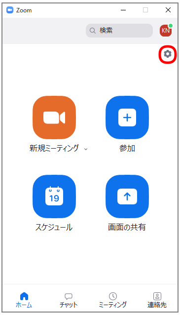

    - 左のメニューから「画面の共有」のタブをクリックし、「画面を共有している場合のウィンドウのサイズ」を「現在のサイズを保持する」に変更します。これにより、講師が画面を共有した場合に、Zoomが全画面モードにならずにすみます

    

    - Zoomの設定は以上で終了です

## Slackの設定

- チュートリアルでは Slack というツールを使って、事務連絡や当日の質疑応答を行います。以下の手順で設定してください


### ウェブブラウザでの設定

 - 受講者の皆様にメールで招待状が届きます。「今すぐ参加」をクリックしてください

 　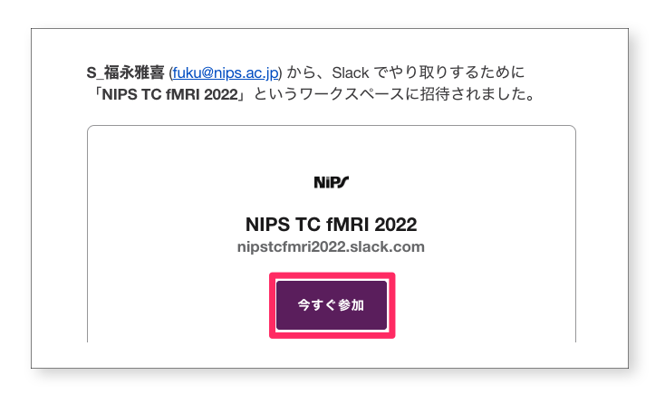

 - Slackのアカウントを持っていない場合、アカウント作成画面が出てきます。Full nameに日本語の氏名、Passwordにご自身で決めたパスワードを入力し、"Create Account"をクリックしてください

 　

 - Slackのアカウントを持っている場合、サインインを要求されますので、メールアドレスとSlack用のパスワードを入力してサインインしてください

 　

### アプリの入手

 - 次に、[slackのダウンロードサイト](https://slack.com/downloads)にアクセスし、自分の使っているOSにあったSlackアプリをダウンロードしてください。Slackはブラウザからも利用可能ですが、アプリの方が使い勝手がいいかもしれません。スクリーンショットはMac版Slackとなっていますが、Windowsの方はWindows版をダウンロードしてください

  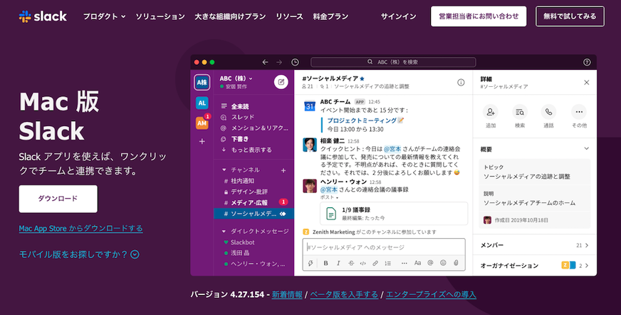

 - アプリを起動すると、はじめての方の場合は、下図のような画面になりますので、"Sign In to Slack"をクリックします

  

 - すでにSlackをお使いの方は、以下の3つのどれかの方法で、ワークスペースにサインインします

 - 左にある＋キーをクリックして、「他のワークスペースにサインインする」をクリックします

  

 - 左上のハンバーガーメニューをクリックし、「ワークスペースを追加」-> 「他のワークスペースにサインインする」をクリックします

  

 - メニューの「ウィンドウ」から「他のワークスペースにサインインする」をクリックします

  

 - サインイン画面が出ますので、メールアドレスを入力し、"Sign In with Email" をクリックします

  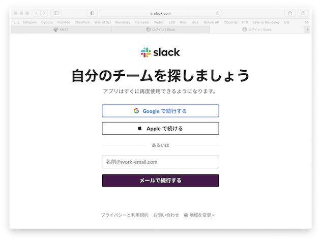

 - そうすると、メールアドレスにサインインのためのコードが送信されますのでそれを入力します

  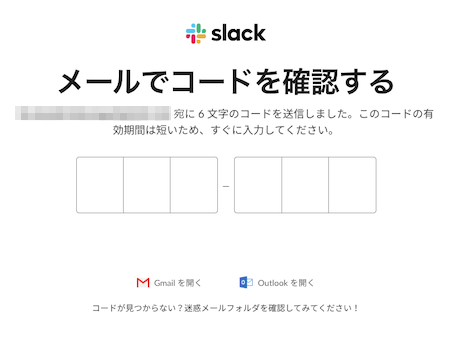

 - NIPS TC fMRI 2021 をクリックします

  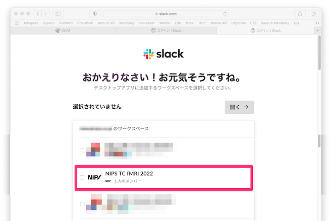

 - "Slackを開きますか？"という質問が出た場合は、"Slackを開く"をクリックします

 - そうすると、第32回生理研トレーニングコース用のワークスペースに入ることができます

  

### チャンネルの使い分け

 - いくつかチャンネルが準備されています。以下のように使い分けていきます

 - 01_事前準備: 事前準備に関する連絡を行うチャンネルです。テキストのアップデートの連絡などをこちらで行います

 - 02_初心者: トレーニングコースにおいて、「講師に聞くほどでもないけど、初心者だから聞いておきたい」質問を受けるチャンネルです。講義中、講師はこのチャンネルは見ません。その代わり、チューターが皆様の質問に対してお答えします。

 - 03_preprocess: Preprocessingのの講義、実習に関する質問を受けるチャンネルです。

 - 04_statistics: 統計の講義、実習に関する質問を受けるチャンネルです。

 - 05_その他の講義: その他の講義に関する質問を受けるチャンネルです。

 - general: 上記以外の質問を受けるチャンネルです。質問により、回答できない場合があります

### お願い

 - トレーニングコースでは、すべて実名でやりとりをしたいと思います。ニックネームではなく、ご自身の名前をフルネームで表示するようにしてください。スタッフはすべて氏名の前にS_がついています

 - テキストだけのやりとりになりますので、どうぞやわらかな言葉での発言をしていただくようにお願いいたします。


----

## 事前準備

- **トレーニングコースの準備に、約4-5時間必要となります。なお、準備が終わった方にのみ当日のZoomのリンクが送信されますので、必ず準備を行ってください。準備なしの参加はできません**

- トレーニングコースに向けて、以下の準備をお願いします

    A. トレーニングコース用Lin4Neuro仮想アプライアンスのダウンロード (2-3時間)

    B. VirtualBoxのインストール (10分)

    C. VirtualBoxへのLin4Neuroのインポート (15分)

    D. 仮想マシンの設定 (5分)

    E. Lin4Neuroの起動と設定 (10分)

    F. トレーニングコーステキストの入手 (3分)

    G. データの入手 (10分)

    I. 受講のためのスクリプト実行 (5分)

    参考. 仮想マシンの削除 (トレーニングコース後、不要になった場合)


- 今回は完全オンライン開催のため、受講者専用サイトに記載されているVirtualBox＋Lin4Neuroの組み合わせによる参加を前提とします。脳画像解析の初心者の方々は受講者専用サイトに記載されている通りに事前準備を行いトレーニングコースへ参加することを強く推奨します
- **Lin4Neuroは、筑波大学の根本清貴先生が開発、配布されているLinux上に構築された脳画像解析ツール群です。根本先生のご厚意により、トレーニングコースで利用させて頂きます**
  - [Lin4Neuro](https://www.nemotos.net/?page_id=556)
- 自分自身で基礎的なトラブルシューティングが行える脳画像解析の経験が豊富な中級者以上の方々は、受講者専用サイトに記載されている以外の解析環境（例えば受講者自身が構築した解析環境など）でもトレーニングコースに参加可能ですが、原則としてチューターによるサポートの対象外とさせて頂きます。ご理解、ご協力の程、よろしくお願いします
- 今回のトレーニングコースで使用するLin4Neuroのバージョンは、L4N-1804-abis-20201030です。2020年12月、2021年1月に開催されたABiS脳画像解析チュートリアルに参加された方は、再インストールせずに参加頂くことが可能です。**それより過去のLin4Neuroは使用できませんのでご注意ください**
- ソフトウェアとデータのダウンロードで合計**30GB程度ダウンロードします**。Pocket Wi-Fiなどでは通信量にご注意下さい。**職場やご自宅のLAN環境からの作業**を強くお奨めします


### A. トレーニングコース用Lin4Neuro仮想アプライアンスのダウンロード (所要時間約2-3時間)

- 分散ダウンロード(推奨): Lin4Neuroは26GBありますので、分散ダウンロードできるプログラムを準備してあります。自身の環境にあわせて以下の対処を行ってください。Lin4Neuroを30のファイルに分割してダウンロードします。ネットワークの環境にもよりますが、1ファイルあたり3〜5分程度かかりますので、ダウンロード終了に約2〜3時間かかるとお考えください

    - Windows10

        - [Windows用ダウンローダー](https://github.com/kytk/abis-web/raw/master/util/l4n_win.zip)をダウンロードします

        - l4n_win.zip を展開します

        - l4n_win フォルダの中にある `get_L4N_win.bat` をダブルクリックします

        - 「WindowsによってPCが保護されました」という画面が出ますので、「詳細情報」をクリックします

        - 右下に「実行」ボタンが出ますので、実行をクリックします

        - コマンドプロンプトの画面が立ち上がり、aria2cというプログラムによるダウンロードが始まります

        - ダウンロードが完了すると、L4N-1804-abis-20201030 フォルダの中に L4N-1804-abis-20201030.ova というファイルが生成されます

        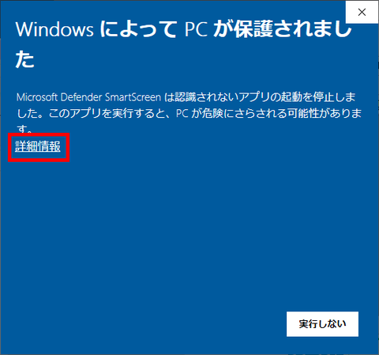

        

        

    - macOS

        - [macOS用ダウンローダー](https://github.com/kytk/abis-web/raw/master/util/l4n_mac.zip)をダウンロードします

        - l4n_mac.zip を展開します

        - l4n_mac フォルダの中にある `get_L4N.command` をダブルクリックします

        - 下図のように「開発元が未確認のため開けません。」と出るので、一度<kbd>OK</kbd>を押して、閉じます

        - 画面左上のAppleメニューから、システム環境設定をクリックし、「セキュリティとプライバシー」をクリックします

        - 「get_L4N.commandは開発元を確認できないため、使用がブロックされました。」の右側にある「このまま開く」をクリックします

        - 「開発元を検証できません。開いてもよろしいですか？」に対して、「開く」を選択します

        - そうすると、ターミナルが起動し、ダウンロードがはじまります

        - ダウンロードが完了すると、L4N-1804-abis-20201030 フォルダの中に L4N-1804-abis-20201030.ova というファイルが生成されます

        

        

        

        


- 一括ダウンロード: 十分にネットワークが安定している方は、以下からダウンロードしてください。26GBありますのでダウンロードには2〜3時間かかります。ネットワークが細い方は、上の分割ダウンロードを選択してください

    - [L4N-1804-abis-20201030.ovaのダウンロード](http://www.md.tsukuba.ac.jp/clinical-med/psy-neuroimaging/L4N/L4N-1804-abis-20201030.ova)

    - L4N-1804-abis-20201020.ovaのmd5値は、`877bcee4385adfb019397eaa8a8cef67` になります。ファイルサイズの検証にお使いください

        - macOSならば、`openssl md5 L4N-1804-abis-20201030.ova` で確認できます
        - Windowsならば、PowerShellから、`Get-FileHash -Algorithm md5 L4N-1802-abis-20201030.ova` で確認できます


### B. VirtualBox 6.1.16以降 のインストール (所要時間約10分)

トレーニングコースでは、**<span style="color: red; ">VirtualBox 6.1.16以降</span>**の上で Lin4Neuro を動作させます。Lin4Neuro は、VirtualBox 6.1.16以降で最適化されているため、前のバージョンのVirtualBoxを使用の方は**必ず最新版(6.1.24)にアップグレードしてください。**特に**macOSは、6.1.16以前では仮想マシンが立ち上がらない不具合があります**のでご注意ください

- [VirtualBoxのサイト](https://www.virtualbox.org/wiki/Downloads) から、ご自身のOSにあったVirtualBoxのインストーラーをダウンロードします

- ダウンロードしたインストーラーを用いてVirtualBox 6.1 をインストールします

- インストール後、VirtualBoxを起動します

    

    - macOSでインストールに失敗する場合は、[macOS High Sierra以降で VirtualBox のインストールに失敗する時の最終的な対処法](https://www.nemotos.net/?p=2619) を参照ください

### C. Lin4Neuro仮想アプライアンスのインポート (所要時間約15分)

- ダウンロードした仮想アプライアンス (L4N-1804-abis-20201030.ova) を用いて仮想マシンをインポートします

- VirtualBoxのメニューから **ファイル** → **仮想アプライアンスのインポート** を選択します

    

- ファイルに、ダウンロードした **L4N-1804-abis-20201030.ova** を指定し、 **<kbd>次へ</kbd>** をクリックします

    

- 設定画面が出ます。ひとつだけ気をつけていただきたいのが、 **Machine Base Folder** です。このフォルダの下に仮想マシンがインストールされます。必ず、**<span style="color: red; ">100GB以上あいているところを指定してください</span>**(容量が十分にある場合は、デフォルトのままでかまいません)。外部ハードディスクを指定することもできます。SDカードは、速度が異常に遅く実用性に耐えられませんので、使わないでください

- 設定を確認したうえで、 **インポート** をクリックしてください
- インポートには10−15分程度かかります。辛抱強くお待ちください

    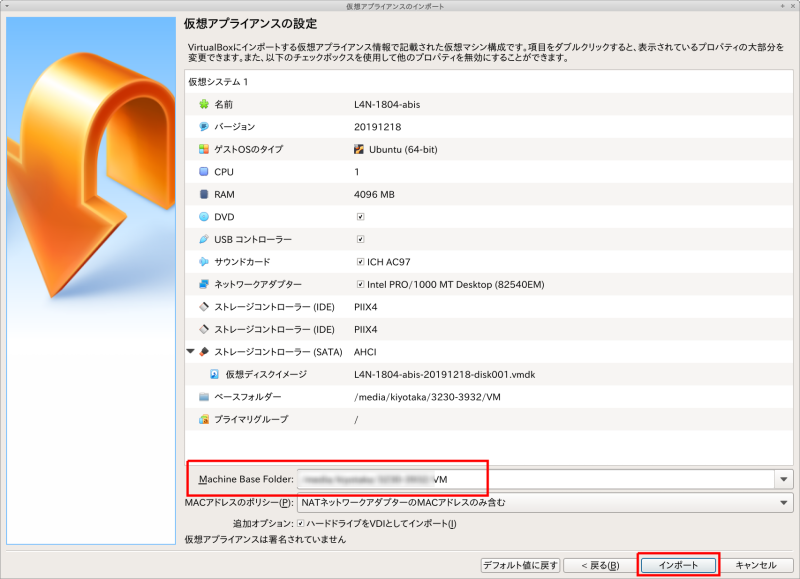

- インポートが終了すると、VirtualBoxのメイン画面に、 **L4N-1804-abis** が表示されます

    

### D. 仮想マシンの設定 (所要時間約5分)

#### 1. 共有フォルダの設定

- **30GB以上**あいているところに、Macの方はFinderから、Windowsの方はエクスプローラーから、 **share** というフォルダを作成します。すべて小文字で作成してください

- あとで確認するため、作成した share フォルダに、何か適当なファイルを入れておいてください

- VirtualBoxのメイン画面で、L4N-1804-abisをクリックし、選択してから、 **設定** をクリックします

    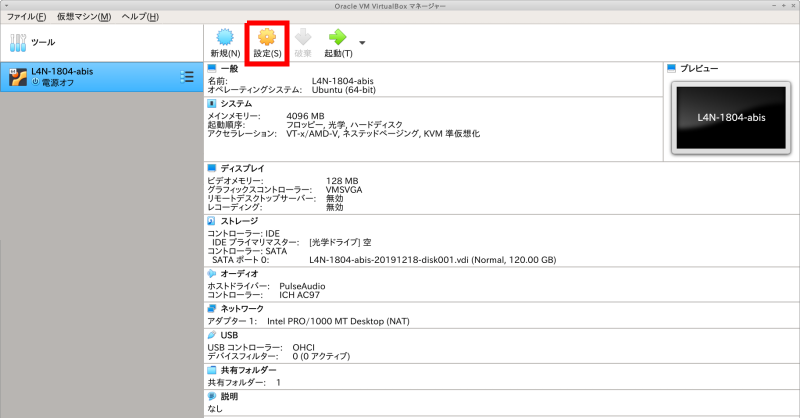

- 設定画面の左側のペインで **共有フォルダー** をクリックしたうえで、画面右側の共有フォルダを追加するアイコンをクリックします

    

- **フォルダーのパス** の右側の▼から、**その他...** を選択し、先程作成した **share** フォルダを選択します

- フォルダー名が **share** になっていることを確認します

- **読み込み専用** と **自動マウント** は**チェックが入っていない**ことを確認してください

- このうえで、 **<kbd>OK</kbd>** をクリックします

    

#### 2. メモリとCPUの設定

- 次に、設定画面の上から2番め、**システム** をクリックします

- メインメモリーがデフォルトでは、4096MB、すなわち4GBとなっています。これを、ご自身のPCのメモリに余裕があるならば、増やしてください。Windows/macOSが安定して動くためには、システムに最低4GB(できれば8GB)を与えることは必要です。そのうえで、Lin4Neuroのメモリを増やすことで、動きが改善します。できれば、デスクトップマシンで16GBのメモリを搭載しているならば、仮想マシンに8GB (8192MB)と設定してあげてください。1GB=1024MBです

    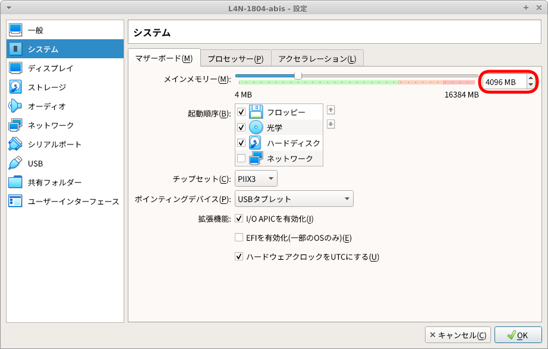

- 次に、「プロセッサー」のタブをクリックしてください。デスクトップPCでコア数を多く積んでいるPCで動かす場合は、このプロセッサー数を増やしていただくことで、Lin4NeuroでCPUでの並列計算ができるようになります。インジケーターが緑の範囲であれば増やすことは問題ありません（その分、仮想マシンが動いている場合は、ホストのWindows/macOSで使えるCPUのコア数が減りますのでご了承ください）

    

- これで、設定は終了です

### E. Lin4Neuroの起動と設定 (所要時間約10分)

- VirtualBoxのメイン画面から、 **L4N-1804-abis** を選択したうえで、 **起動** をクリックします

    

    - macOSの場合、「マイクにアクセスすることを許可します」と出た場合、<kbd>OK</kbd> をクリックして許可してください。そうしないと起動しません

- 下図のような画面になります。Enter/return を押すかそのまま待てば自動で起動します

    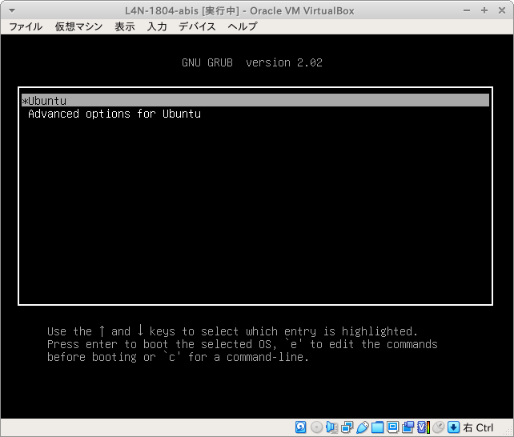

- ログイン画面が立ち上がります。パスワードは **lin4neuro** です。すべて小文字です

    

- ログインすると、Ubuntu 20.04 にアップグレードするかどうかを聞くダイアログがあらわれる時があります。その時は "Don't Upgrade" を選択してください

    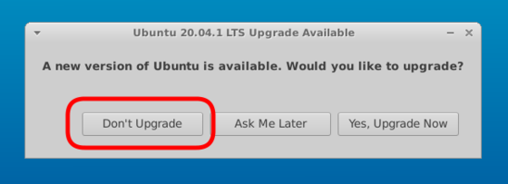

- Ubuntu 18.04のアップデートの画面に関しては、"Install Now" を選択してください

    

- パスワードを聞かれます。小文字で **lin4neuro** と入力してください

    


#### 1. キーボード設定の確認

- 配布しているLin4Neuroの仮想マシンは日本語キーボードで設定されています。英語キーボードにするには、以下の作業を行ってください

- メニューから "設定" -> "Fcitx設定" を選択します

    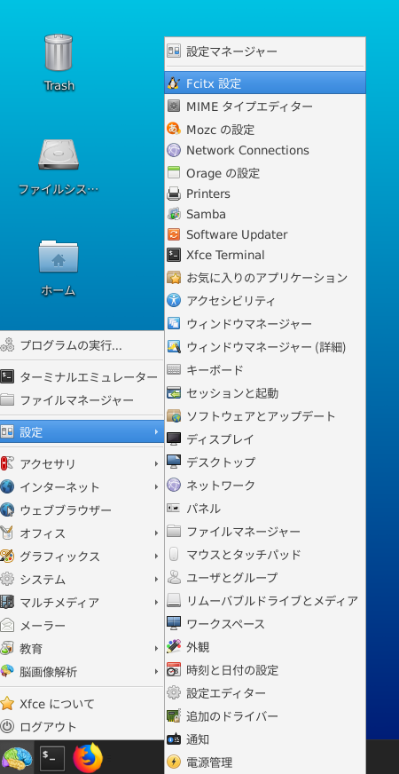

- 画面下の矢印を使って、"キーボード - 英語(US)" が一番来るようにして、ウィンドウを閉じます

    

#### 2. 画面のフォント設定

- VirtualBoxのメニューから "表示" -> "仮想スクリーン" -> "XX%にスケール" を選択してください。適宜見やすい大きさに調整してください

    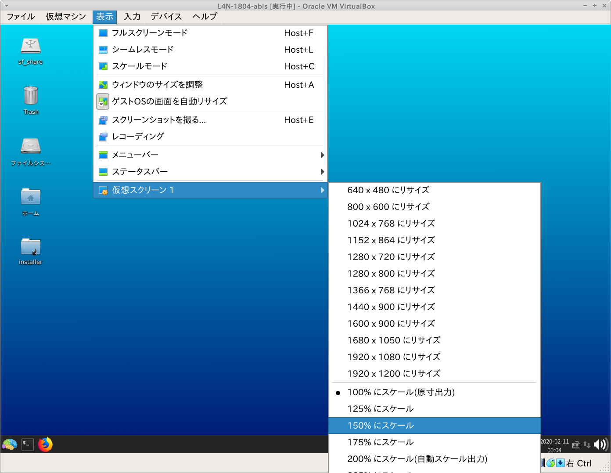

#### 3. ドラッグ&ドロップの無効化 (Windowsのみ)

- Windowsの方は、VirtualBoxのメニューから "デバイス" -> "ドラッグ&ドロップ" -> "無効" を選択してください。これをすることで、Lin4Neuroの共有フォルダのパーミッションが適切になります。

    

- その後、再起動します。Lin4Neuroの左下のメニューから、「ログアウト」をクリックし、そして再起動をします。

    

    

#### 4. 共有フォルダの確認

- 画面左上にある **sf_share** は共有フォルダとして設定したものです

- sf_share をダブルクリックし、先程試しに入れたファイルが見えることを確認してください

#### 5. 画像解析ツールの確認

- ログインした後、左下の脳のアイコンをクリックし、 **脳画像解析** をクリックすると、インストールされているソフトウェアを確認できます

    

#### 6. SPMの確認

脳画像解析のメニューリストにSPM12のアイコンがありますが、今回は使用しません。以下で確認します

- 画面左下の脳アイコンの右側にあるターミナルアイコンをクリックし、ターミナルを起動します

    

- ターミナルに以下をタイプします。コピペする場合は、Windows, macOSともに コピーした後に、マウスで右クリックして貼り付けを選ぶか、 Ctrl (ctrl) + Shift + V をタイプすることによりペーストできます(以下、タイプが必要なところはすべて同様に作業できます)

    ```
    spm fmri
    ```

- 以下のような画面が出ます。SPMを使用中は、ターミナルは閉じないで下さい

    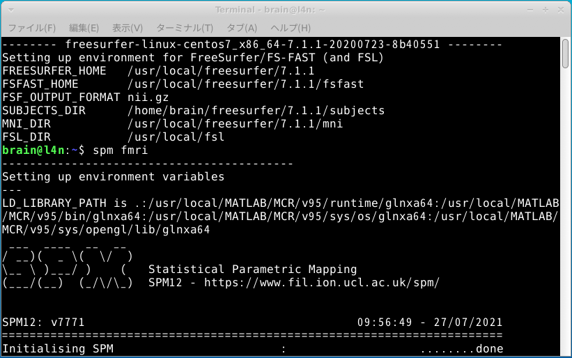

- 少し時間がかかりますが、以下のようなウインドウが出れば、SPMがきちんと動作することを確認できます

    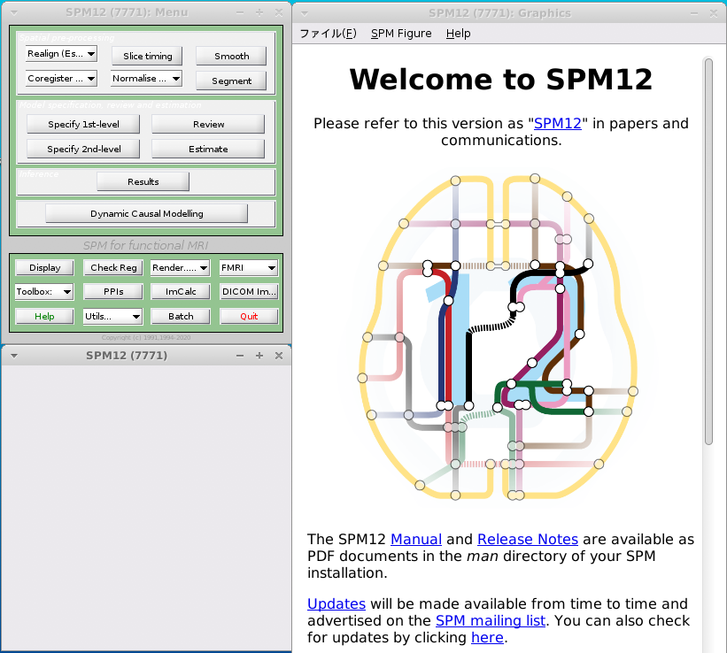

- 起動の確認が終われば、"Quit" を選択してSPMを終了します


### F. トレーニングコーステキストの入手 (所要時間約3分)

- 本トレーニングコースで使用するテキストは、GitLabというデータ共有サービスを通して配布します。ここで配布されるものは、トレーニングコースの直前まで更新される可能性がありますので、こまめに（特に参加直前に）アップデートするようにして下さい

1. 初めてセットアップする時: ターミナル (Lin4Neuro では、左下のスタートアイコンの隣にあるアイコンから起動できます) から以下を実行して下さい

    ```
    cd /media/sf_share
    メールで示されているコマンドをここにタイプします
    (セキュリティの都合でここには記しません)
    ```

2. 更新する時: ターミナルから以下を実行してください

    ```
    cd /media/sf_share/nips-2021TC
    git pull
    ```

- こうすると、`/media/sf_share/nips-2021TC` の下に `spm`, `get_data.pdf`, `nips-2021TC.m`, `nips-2021TC_textbook.html`, `set_data_nips_tc_fmri_2021.sh` といったフォルダやファイルが生成されます

    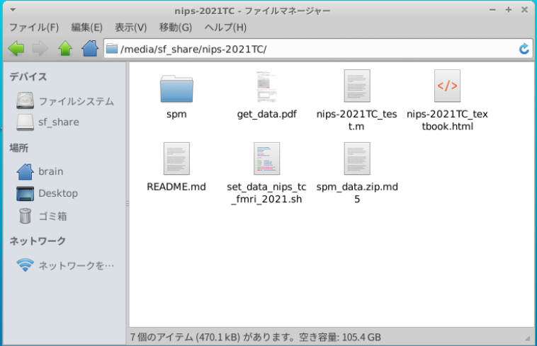


- `nips-2021TC_textbook.html` の中にテキストへのリンクが掲載されています

- その他のフォルダは講義で使用します

#### プロキシサーバーなどを使っている場合

- PCがプロキシサーバを経由して外部ネットワークに接続されている場合は、先にターミナルから以下のコマンドを入力し、Gitに対するプロキシ設定を行って下さい

    ```
    git config --global http.proxy  http://プロキシ名:ポート番号
    git config --global https.proxy http://プロキシ名:ポート番号
    ```

- プロキシ名やポート番号は、所属機関･部署のネットワーク管理者にお尋ね下さい

- プロキシ設定が不要になった時は、以下のコマンドによって解除できます：

    ```
    git config --global --unset http.proxy
    git config --global --unset https.proxy
    ```

### G. データの入手 (所要時間約10分)

- トレーニングコースに使うデータは非常に大きいため、GitLabではなく、別にダウンロードしていただきます

- 上記のテキストの入手を行った後、ファイルマネージャーで `get_data.pdf` をダブルクリックして下さい

  - PDFファイルの指示に従ってデータをダウンロードして下さい。データが1GB程度あります。環境によっては時間がかかってしまうことがあるため、電源をつなぎ、パソコンがスリープしないようにしてください

    

- データのダウンロードを行った後、ターミナルから以下をタイプしてください

    ```
    cd /media/sf_share/nips-2021TC
    bash ./set_data_nips_tc_fmri_2021.sh
    ```

- こうすると、`spm` のフォルダの中に `Localizer` `LOOanalysis` `Manuals` というフォルダができます


### H. 確認のためのバッチスクリプトを実行 (所要時間約5分)

- 環境が整っているかを確認するために、バッチスクリプトを実行していただきます

- ターミナルからSPMを起動してください

- SPM12 MenuウインドウからBatchを選択してください

    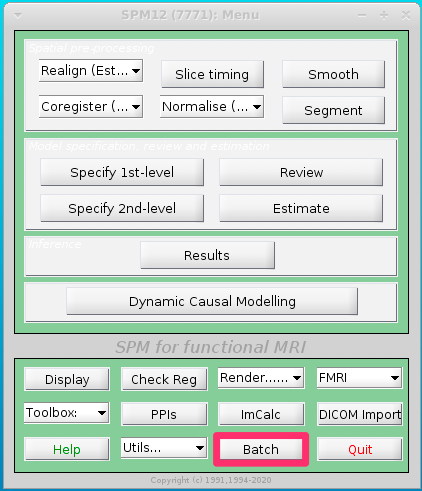

- 以下のウインドウが表示されますので、①-②の順でバッチスクリプトを読み込みます

    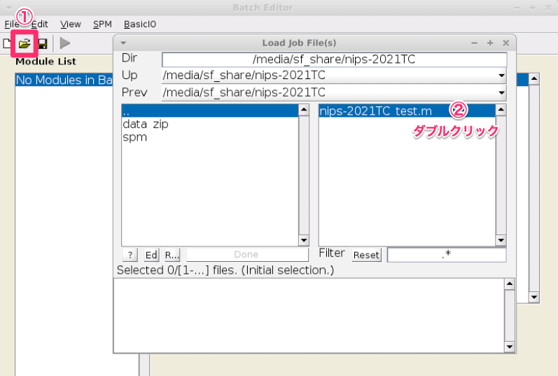

- `nips-2021TC_test.m` が選択されたことを確認して、DONEを選択します

    

- ウインドウ上部の三角がグリーンに変化するので選択します

    

- MRIの断面画像が表示されます

    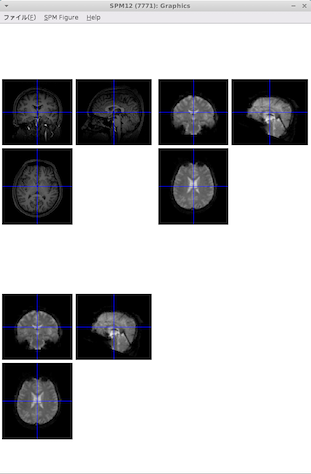

- 画像が正しく表示された方は、準備がすべて整ったことになります

    - もし、正しく表示できなかった場合は、データの入手からやり直して下さい

- ここまでたどりつけない場合は、事前サポートが必要になります。今回、Zoomのため、トレーニングコース当日の個別サポートが提供できませんので、このプロセスは必須とさせていただきます


## Lin4Neuroの終了

- Lin4Neuroを終了するには、左下の脳のアイコンをしたスタートメニューから ログアウト → シャットダウン を選択します


## ログイン画面の修正

- Lin4Neuroをアップデートした際、ログイン画面が下図のように背景が真っ黒になってしまうことがあります。これは、システムアップデートによりログイン画面の設定がリセットされてしまうことによります。

    

- これに対して、以下で解決できます

    ```
    cd ~/git/lin4neuro-bionic
    git pull
    ./patch_greeter.sh
    ```

- パスワードは `lin4neuro` です

- 再起動するとログイン画面が元に戻ります


## Lin4Neuro への Google chrome のインストール (所要時間5分)

- Lin4NeuroにGoogle Chromeをインストールしたい方向けに、説明動画を準備しました。[こちら](https://vimeo.com/487737208)からご確認ください


## 問い合わせ

- 準備がうまくいかない時は、メールで案内した Slack の事前準備チャンネルで問い合わせ下さい。

- [nipstcfmri2021.slack.com](https://nipstcfmri2021.slack.com/)


## トラブルシューティング

- これまでに問い合わせをいただいた内容とその対策を紹介します

- 【質問1】「D. 仮想マシンの設定 (所要時間約5分)」の作業中、VirtualBoxのメイン画面から設定タブを押すと設定画面の下部に「無効な設定が見つかりました。」と表示され、共有フォルダなどの設定が出来ませんでした。設定をしない状態で起動を押しても、「仮想マシン"L4N-1804-abis"のセッションを開けませんでした。」という警告が出てしまいます。

    - 【回答1】これは、主にHPのPCで、仮想化が有効にされていないことによります。以下の方法で解決できます

        - 一度インポートしたLin4Neuroの仮想マシンを削除してください。本ページの最後のセクションを参考にしていただけたらと思います。ダウンロードしてできている .ova ファイルはまだ削除しないでください。

        - HPのBIOS設定からVT-xを有効にします。[HPの公式サイト](https://support.hp.com/jp-ja/document/c04773368) に記載がありますので、こちらを参考にしてください。

        - 再起動し、VirtualBoxに再度仮想アプライアンス（L4N-1804-abis-20201030.ova）をインポートします。

- 【質問2】「C. Lin4Neuro仮想アプライアンスのインポート」の説明の通りに，ファイル → 仮想アプライアンスのインポート→ ダウンロードした「L4N-1804-abis-20201030.ova 」を指定→Machine Base Folder はデフォルトのまま→インポート，と一連の作業をしてみましたが，「仮想アプライアンスに失敗しました」とエラーが表示されました。ストレージは残り約600GB利用可能です。詳細のボタンをクリックすると「終了コード：NS_ERROR_INVALID_ARG (0x80070057)」と表示されます。

    - 【回答2-1】これは、Machine Base Folderに同じファイルがなんらかの理由で存在する時に起きる症状です。[こちらのページ](http://www.is.chs.nihon-u.ac.jp/students/file/import_E_INVALIDARG.pdf)に解決法が記載されています

        - 仮想メディアマネージャーを確認し、L4N-1804-abis-xxxx.vdi などがないか確認します。あったら削除してください

        - VirtualBox VMs のフォルダに L4N-1804-abis というフォルダがないかどうかを確認してください。あったらそれを削除してください

        - 再起動したうえで、再度インポートするとインポートできます

    - 【回答2-2】 もうひとつの可能性は、ダウンロードしたovaファイルが壊れていることによります。再ダウンロードをしていただけたらと思います

----

## 参考. 仮想マシンの削除 (トレーニングコース後、不要になった場合)

1. 仮想マシンを削除するには、VirtualBoxのメイン画面で、削除したい仮想マシンを選び、右クリックをして、**除去(R)...** を選択します

    

2. 次にあらわれる画面で、**すべてのファイルを削除** を選択します

    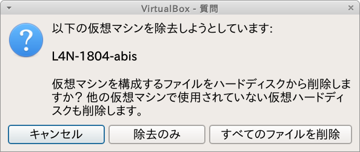
 
